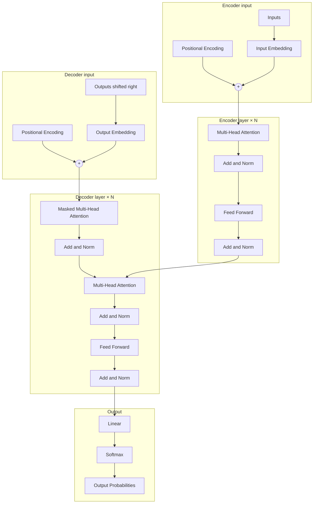

# Attention Is All You Need — Deep Analysis

An educational PyTorch implementation and analysis workspace centered on the Transformer architecture introduced by Vaswani et al. in [*Attention Is All You Need*](https://arxiv.org/abs/1706.03762). The repository is organized so each major mechanism from the paper lives in its own module, building from primitives (attention) to full encoder–decoder stacks and a configurable training entry point.

----
# Documentation 
Full explanation, diagrams, code walkthrough, and experiments are available on the **[documentation website](https://project-documentation-iota.vercel.app/)**

---
# Dataset

For training and experimentation, this project uses the **[Multi30k Dataset (Hugging Face)](https://huggingface.co/datasets/bentrevett/multi30k)**, a widely used benchmark for English–German machine translation tasks. It provides parallel sentence pairs suitable for sequence-to-sequence and Transformer evaluation.

---
### Architecture Overview

## Repository layout

| Path | Role |
|------|------|
| `01_attention` | Scaled dot-product attention and tests. |
| `02_multi_head_attention` | Multi-head attention module and tests. |
| `03_positional_encoding` | Positional encoding implementation and `visualization.ipynb` for exploration. |
| `04_encoder_block` | Single encoder layer (self-attention + FFN + norms). |
| `05_decoder_block` | Decoder layer (masked self-attention, encoder–decoder attention, FFN) and masking helpers. |
| `06_transformer_full` | End-to-end `Transformer`, `train.py`, and `config.yaml`. |
| `experiments` | Ablation-style scripts and `results.md` documenting comparisons (e.g., single vs multi-head expectations vs paper Table 3). |

---
## Quick Start
Install dependencies:
```bash
pip install torch pyyaml matplotlib jupyter
```
Training
```bash
python 06_transformer_full/train.py
```
or for translation experiment 
```bash
python 06_transformer_full/train_translation.py
```

## Reference

Ashish Vaswani, Noam Shazeer, Niki Parmar, Jakob Uszkoreit, Llion Jones, Aidan N. Gomez, Łukasz Kaiser, Illia Polosukhin (2017). *Attention Is All You Need.* NeurIPS. [arXiv:1706.03762](https://arxiv.org/abs/1706.03762).
