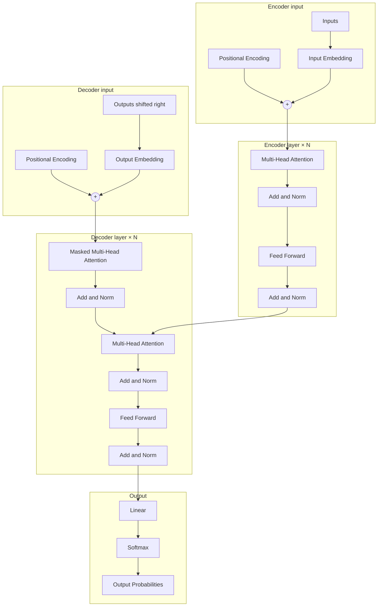
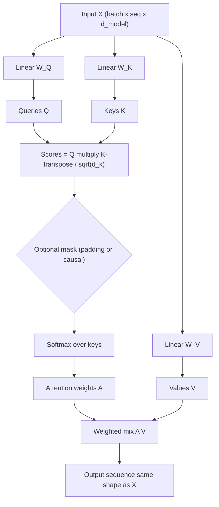

# Attention Is All You Need — Deep Analysis

An educational PyTorch implementation and analysis workspace centered on the Transformer architecture introduced by Vaswani et al. in [*Attention Is All You Need*](https://arxiv.org/abs/1706.03762). The repository is organized so each major mechanism from the paper lives in its own module, building from primitives (attention) to full encoder–decoder stacks and a configurable training entry point.

---

## Visuals

Diagrams use [Mermaid](https://mermaid.js.org/) so they render on GitHub as **code blocks** (no bundled image files). They follow the layout of Figure 1 in Vaswani et al. ([arXiv:1706.03762](https://arxiv.org/abs/1706.03762)).

### Transformer architecture

End-to-end **seq2seq** flow: **Inputs** → encoder stack **N×** → memory fed into the decoder; **Outputs (shifted right)** → decoder stack **N×** → **Linear** → **Softmax** → probabilities. Residual arrows are implicit in each **Add & Norm** after a sub-layer.



Each **encoder layer** is multi-head **self**-attention over the source, then FFN, each wrapped with residual + norm. Each **decoder layer** is **masked** self-attention, then **encoder–decoder** attention (keys/values from the encoder top), then FFN, again with residual + norm after each block.

---

### Self-attention (scaled dot-product)

For one attention head, the same input `X` is projected to **queries**, **keys**, and **values**. Alignment scores are dot products scaled by \(1/\sqrt{d_k}\); softmax yields a **weight matrix** over keys; the output is a **weighted sum of values**. Optional **masks** zero out illegal positions (padding or future tokens) before softmax.



**Matrix view:** `A` has shape `(query positions × key positions)`. Row \(i\) is how much query position \(i\) attends to every key \(j\). This repo implements the same pipeline in `01_attention/attention.py` and stacks multiple heads in `02_multi_head_attention/`.

For **plots** (heatmaps, positional curves), open `03_positional_encoding/visualization.ipynb`.

---

## Purpose and motivation

Sequence modeling historically relied on recurrent or convolutional structure to propagate information across time steps. The Transformer replaces recurrence with **pure attention**: every position can attend to every other position in **one or two depth-wise passes**, enabling highly parallel training and long-range dependencies mediated directly by learned pairwise weights.

This project exists to:

- **Explain by construction**: implement scaled dot-product attention, multi-head attention, positional encoding, and encoder/decoder blocks in **incremental stages** (`01_` through `06_`), matching how the paper stacks ideas.
- **Ground claims in code**: unit tests exercise shapes, masking, and normalization behavior expected from the paper’s formulation.
- **Support experimentation**: scripts under `experiments/` sketch ablations (e.g., multi-head vs single-head, effects of positional encoding) aligned with discussions and tables in the original work.
- **Provide a training scaffold**: `06_transformer_full/` wires embeddings, positional encoding, stacked layers, and a teacher-forced loss loop with YAML-driven hyperparameters (paper-scale defaults such as `d_model=512`, `N=6`, `h=8`, `d_ff=2048`).

The intended reader is someone who wants both **intuition** (what each block does and why) and **executable reference** (how tensors flow and how masks enforce causality).

---

## Written report (website)

Long-form analysis, figures, and narrative notes will live on a separate site (not in this repo). When your site is published, put the URL here:

**[Open the written report](https://example.com)** — replace `https://example.com` with your real link (e.g. GitHub Pages, Notion, or a personal domain).

---

## Core ideas introduced by this repository

| Idea | What it means here |
|------|---------------------|
| **Scaled dot-product attention** | Queries, keys, and values; softmax over keys scaled by \(1/\sqrt{d_k}\); optional masks for padding or future-token blocking. Implemented in `01_attention/`. |
| **Multi-head attention** | Parallel attention in several subspaces (heads), then concatenation and projection—letting the model specialize different heads on different relational patterns. Implemented in `02_multi_head_attention/`. |
| **Positional encoding** | Attention is permutation-invariant without position information; sinusoidal (or learned) encodings are added to embeddings so order matters. Explored in `03_positional_encoding/` (including a visualization notebook). |
| **Encoder layer** | Self-attention sub-layer + position-wise feed-forward, each with residual connection and layer normalization (post-norm style as in the reference implementation path here). `04_encoder_block/`. |
| **Decoder layer** | Masked self-attention + cross-attention to encoder output + feed-forward, again with residuals and normalization. `05_decoder_block/` (includes causal masking utilities). |
| **Full Transformer** | Embedding scales \(\sqrt{d_{\text{model}}}\), stacked encoder and decoder, final linear layer over the target vocabulary. `06_transformer_full/transformer.py`, with `train.py` and `config.yaml`. |

Together, these pieces illustrate the paper’s central thesis: **attention mechanisms alone can constitute a competitive sequence transduction model** when combined with depth, multi-head structure, positional information, and feed-forward processing between attention layers.

---

## Repository layout

| Path | Role |
|------|------|
| `01_attention` | Scaled dot-product attention and tests. |
| `02_multi_head_attention` | Multi-head attention module and tests. |
| `03_positional_encoding` | Positional encoding implementation and `visualization.ipynb` for exploration. |
| `04_encoder_block` | Single encoder layer (self-attention + FFN + norms). |
| `05_decoder_block` | Decoder layer (masked self-attention, encoder–decoder attention, FFN) and masking helpers. |
| `06_transformer_full` | End-to-end `Transformer`, `train.py`, and `config.yaml`. |
| `utils` | Shared pieces such as position-wise FFN, layer normalization, and helpers (e.g., causal mask generation). |
| `experiments` | Ablation-style scripts and `results.md` documenting comparisons (e.g., single vs multi-head expectations vs paper Table 3). |

Suggested reading order for the code mirrors the numbering above: attention → multi-head → positional encoding → encoder → decoder → full model.

---

## Requirements

- Python 3.x  
- PyTorch  
- For notebooks and plots: `matplotlib`, `jupyter` (optional but recommended for `03_positional_encoding/visualization.ipynb`)  
- For training config loading: `pyyaml`

Example installation:

```bash
pip install torch matplotlib jupyter pyyaml
```

Using a virtual environment is recommended (`python -m venv venv`).

---

## Testing

Modules import neighboring files by **working directory**, so run each test module from inside its folder after activating your environment:

```bash
cd 01_attention && python -m unittest test_attention -v
cd ../02_multi_head_attention && python -m unittest test_multi_head -v
cd ../04_encoder_block && python -m unittest test_encoder -v
cd ../05_decoder_block && python -m unittest test_decoder -v
```

(On Windows PowerShell you can run the same commands with `;` instead of `&&` if needed.)

---

## Training

From the repository root:

```bash
python 06_transformer_full/train.py
```

Hyperparameters are read from `06_transformer_full/config.yaml` (vocabulary sizes, `d_model`, number of layers and heads, `d_ff`, sequence length, dropout, batch size, epochs). The provided training loop uses **synthetic token batches** as a demonstration; substitute a real parallel corpus and dataloaders for machine translation or another seq2seq task to reproduce paper-scale results.

---

## Experiments

- **`experiments/single_vs_multi_head/`** — Compares single-head vs multi-head setups in the spirit of the paper’s head-count ablation.  
- **`experiments/ablation_no_positional/`** — Illustrates disabling positional encoding to stress why order information is necessary.  
- **`experiments/results.md`** — Template and notes tying runs to paper-reported metrics (e.g., BLEU expectations).

---

## Scope and limitations

This repository prioritizes **clarity and modularity** over matching every production detail of the reference Tensor2Tensor implementation. Training defaults echo the paper’s base model, but **reported BLEU scores require full data preparation, BPE or word-piece vocabularies, learning-rate warmup as in the paper, and adequate compute**. Use this project as a map of the architecture and a starting point for extensions rather than a turnkey reproduction benchmark.

---

## Reference

Ashish Vaswani, Noam Shazeer, Niki Parmar, Jakob Uszkoreit, Llion Jones, Aidan N. Gomez, Łukasz Kaiser, Illia Polosukhin (2017). *Attention Is All You Need.* NeurIPS. [arXiv:1706.03762](https://arxiv.org/abs/1706.03762).
